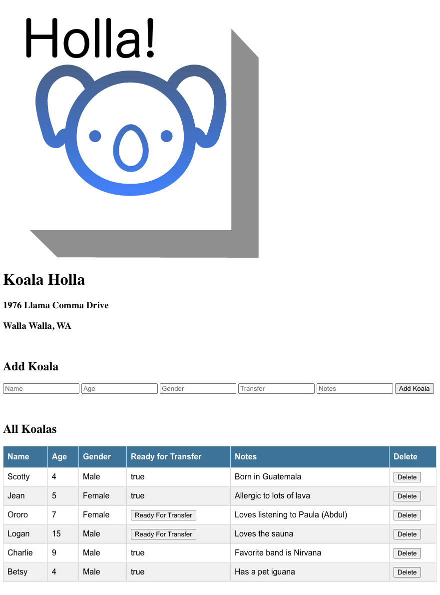

# Koala Holla

## Description

This app allows the user to input a Koala into a database using a form. Each Koala has 5 attributes: `Name`, `Age`, `Gender`, `Ready for Transfer` (true or false) and `Notes`. The Koalas and their attributes from the database are displayed in a table below the form. Once a Koala has been added to the database, it can be deleted by clicking the delete button. If a Koala's `Ready for Transfer` attribute is set to false, the user can click a `Ready for Transfer` button to change the attribute to true.

## Screenshot

## Technologies

* Node
* Express
* SQL

## Installation

1. Follow the instructions in `koalas.sql` to set up the database
2. In a terminal window, type `npm install`
3. Then type `npm start`
4. Navigate to `http://localhost:5001/`